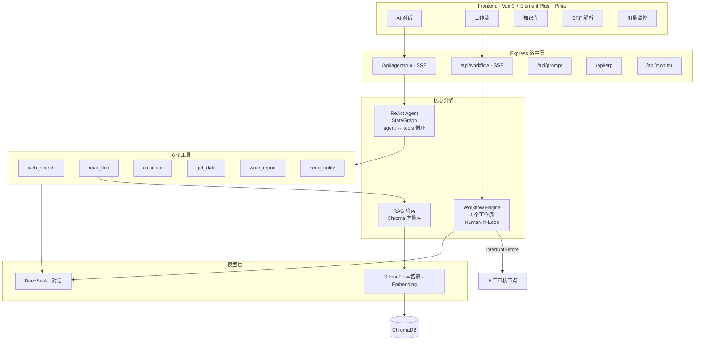

# WorkMind AI

[](https://nodejs.org/)
[](https://expressjs.com/)
[](https://langchain-ai.github.io/langgraphjs/)
[](https://vuejs.org/)
[](https://platform.deepseek.com/)
[](https://www.trychroma.com/)

> AI 办公助手：基于 LangGraph 的 ReAct Agent + 多工作流引擎 + RAG 知识库，DeepSeek 驱动。

## 一句话概括

WorkMind 是一个面向办公场景的 AI 助手平台——不是简单的聊天机器人，而是能**自主规划、调用工具、检索知识库、生成报告**的智能 Agent。

## 架构总览



## 技术栈

| 维度 | 选型 | 说明 |
|------|------|------|
| 运行时 | Node.js 22 | ESM 模块，原生 --watch |
| 后端框架 | Express 4 | 中间件生态完善 |
| AI 编排 | LangGraph 0.2 | StateGraph 状态图 + streamEvents |
| 对话模型 | DeepSeek-V3 | 中文优秀，价格 GPT-4o 1/10 |
| Embedding | BGE-M3 / text-embedding-3-small | 文本向量化 |
| 向量数据库 | Chroma 1.9 | 开源，本地部署 |
| 前端框架 | Vue 3.4 | Composition API |
| UI 库 | Element Plus 2.13 | 企业级 Vue 3 组件库 |
| 状态管理 | Pinia 2 | Vue 官方推荐 |

## 核心功能

### 1. ReAct Agent（思考 → 行动 → 观察 → 循环）

Agent 不是一问一答，而是**自主推理 + 调用工具**的智能体：

```
用户输入任务
    ↓
Agent 分析：需要哪些步骤？用什么工具？
    ↓
第 1 步：调用 web_search → 获取信息
    ↓
Agent 分析：信息够吗？还需要什么？
    ↓
第 2 步：调用 calculate → 计算数据
    ↓
Agent 分析：可以生成最终答案
    ↓
流式输出完整回答
```

关键实现：
- **LangGraph StateGraph**：`START → agent → tools → agent → ... → END`，最多 8 步
- **streamEvents v2**：推送 `tool_call` → `tool_result` → `token` → `done` 每一步
- **SSE 流式返回**：前端实时看到 Agent 的思考和执行过程

### 2. 6 个可调用工具

每个工具通过 LangChain `tool()` + Zod Schema 定义，`description` 字段是写给模型看的"使用说明书"：

| 工具 | 功能 | 生产可对接 |
|------|------|-----------|
| `web_search` | 搜索最新资讯 | Tavily / SerpAPI |
| `read_doc` | 检索知识库文档 | Chroma RAG |
| `calculate` | 数学计算 | 沙箱化表达式求值 |
| `get_date` | 日期查询 / 工作日计算 | 含工作日算法 |
| `write_report` | 生成结构化报告 | 存数据库 / 发邮件 |
| `send_notify` | 发送通知 | 飞书 / 钉钉 / 邮件 API |

### 3. 4 个工作流（Human-in-Loop）

与 Agent 自由推理不同，工作流是**预设步骤流水线**，所有工作流在"人工审核"节点暂停：

| 工作流 | 步骤链 | 暂停点 |
|--------|--------|--------|
| 📊 周报生成 | 提炼亮点 → 识别风险 → **审核** → 生成周报 | 审核前 |
| 📝 会议纪要 | 提取参会人 → 提取结论 → Action Items → **审核** → 生成纪要 | 审核前 |
| ✉️ 邮件润色 | 分析意图 → 检查问题 → **审核** → 润色输出 | 审核前 |
| 📋 PRD 骨架 | 提取功能点 → 识别约束 → **审核** → 生成 PRD | 审核前 |

通过 `interruptBefore: ['human_review']` 暂停 + `MemorySaver` 持久化，用户可修改后继续。

### 4. RAG 知识库

PDF 上传 → `pdf-parse` 解析 → `RecursiveCharacterTextSplitter` 分块 → Chroma 向量化 → 语义检索

Agent 的 `read_doc` 工具会调用 RAG 检索公司内部文档。

### 5. 其他模块

- **Prompt 管理**：创建、编辑、版本管理 AI Prompt 模板
- **ERP 解析**：智能解析报销/请假表单
- **Monitor 监控**：ECharts 可视化 Token 消耗和调用趋势（含缓存层，30 分钟 TTL）

## 项目结构

```
workmind7/
├── server/
│   └── src/
│       ├── index.js                # Express 启动入口
│       ├── config/index.js         # 统一配置读取
│       ├── routes/                 # 路由层
│       │   ├── agent.js            # Agent SSE 流式路由
│       │   ├── workflow.js         # 工作流路由
│       │   ├── erp.js / prompt.js / monitor.js / health.js
│       ├── services/
│       │   ├── model.js            # 模型工厂（ChatOpenAI 兼容）
│       │   ├── agent/
│       │   │   ├── agent.js        # ReAct Agent（StateGraph）
│       │   │   └── tools.js        # 6 个工具定义
│       │   ├── workflow/
│       │   │   └── workflows.js    # 4 个工作流模板
│       │   ├── rag/                # RAG 知识库检索
│       │   ├── erp/                # ERP 数据解析
│       │   ├── prompt/             # Prompt 模板管理
│       │   ├── chat/memory.js      # 对话记忆
│       │   └── cache.js            # 缓存层
│       ├── middleware/             # 中间件（限流、安全检查）
│       └── utils/                  # 日志、错误处理
├── frontend/
│   └── src/
│       ├── main.js                 # Vue 入口
│       ├── router/                 # 路由配置
│       ├── stores/                 # Pinia stores
│       │   ├── agent.js            # Agent 对话状态
│       │   ├── workflow.js         # 工作流状态
│       │   ├── knowledge.js        # 知识库状态
│       │   ├── monitor.js          # 监控状态
│       │   └── erp.js              # ERP 状态
│       └── views/                  # 各模块页面
└── .env.example                    # 环境变量模板
```

## 快速开始

```bash
# 1. 安装
cd server && npm install
cd ../frontend && npm install

# 2. 配置
cp server/.env.example server/.env
# 编辑 .env，填入 DEEPSEEK_API_KEY

# 3. RAG 需要 Chroma
docker run -d -p 8000:8000 chromadb/chroma

# 4. 启动
cd server && npm run dev     # → localhost:3000
cd frontend && npm run dev   # → localhost:5173
```

## 面试要点

本项目展示的核心能力：

1. **LangGraph StateGraph 编排**：理解图状态机节点、边、条件路由、reducer
2. **工具定义与提示工程**：`tool()` + Zod Schema + description，让模型准确判断调用时机
3. **流式事件系统**：`streamEvents()` 区分 `on_tool_start/end` vs `on_chat_model_stream`
4. **Human-in-Loop**：`interruptBefore` 暂停 + `MemorySaver` 持久化 + `updateState` 恢复
5. **RAG 全流程**：PDF 解析 → RecursiveCharacterTextSplitter → Chroma 向量化 → 语义检索
6. **多模型兼容**：ChatOpenAI 统一接口同时对接 DeepSeek + SiliconFlow + 智谱
7. **安全实践**：`calculate` 工具表达式沙箱过滤，防代码注入
